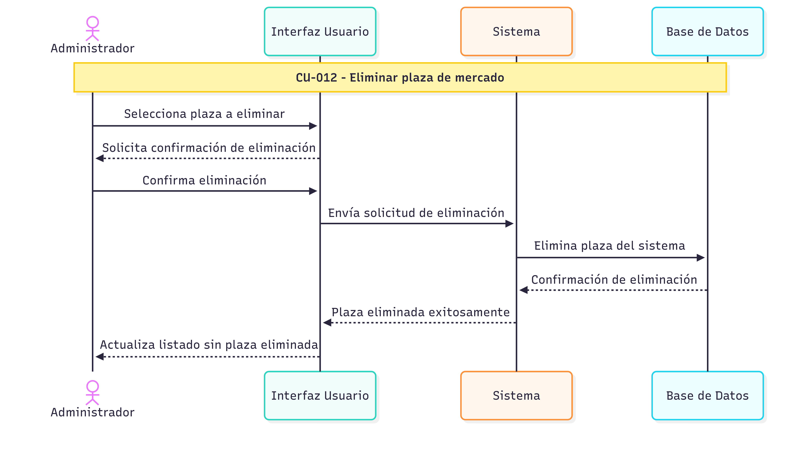

# Diagramas UML

## 📈 Diagramas de Casos de uso

## 🔄 Diagramas de Secuencia

## 🧩 Diagrama de Componentes

## 🗄️ Diagrama Relacional

## Diagramas ad hoc

Las componentes de los diagramas ad hoc se representan:

> Diagramas ad hoc

